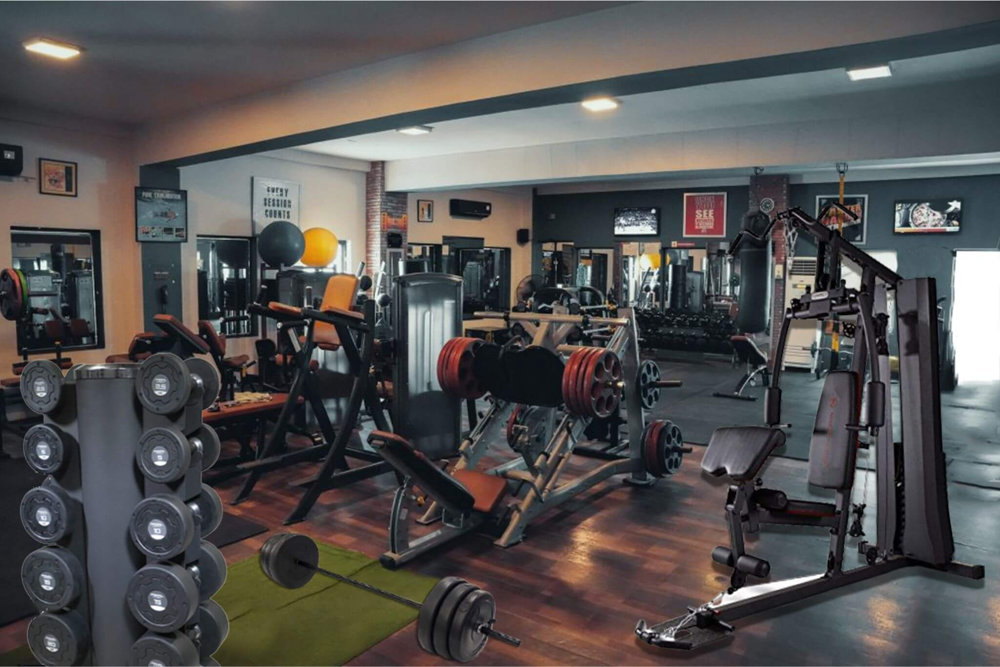

# Structure Health & Fitness



**Structure Health & Fitness** is a modern, responsive full‑stack gym website built with **React.js** (client) and **Node.js / Express** (server). It includes an interactive BMI calculator with visual charts, secure contact handling, and is configured to deploy on **Vercel** as a serverless backend.

---

## 🚀 Live Demo

**Live Preview:** `https://structure-health-fitness-by-laheem.vercel.app`
*Replace the URL above with your live deployment link.*

---

## ✨ Highlights

### Frontend

* Responsive, mobile‑first UI built with **React** and **Bootstrap 5**.
* Interactive **BMI calculator** with visual charts powered by `recharts`.
* Smooth component animations using **framer‑motion**.
* Client‑side form validation and **Google reCAPTCHA v2** for spam protection.
* Routing with **React Router v6** for single‑page navigation.

### Backend

* **Express.js** server to receive contact/membership inquiries and send emails using **Nodemailer**.
* Security hardening with **Helmet** and request **rate limiting**.
* Ready for serverless deployment (Vercel functions) with `vercel.json` rewrites.
* Basic health check endpoint for uptime monitoring.

---

## 🛠️ Tech Stack

| Layer      | Technologies                                             |
| ---------- | -------------------------------------------------------- |
| Frontend   | React, Bootstrap 5, Recharts, Framer Motion, FontAwesome |
| Backend    | Node.js, Express, Nodemailer                             |
| Security   | Google reCAPTCHA v2, Helmet, express-rate-limit          |
| Deployment | Vercel (Frontend + Serverless API)                       |

---

## 📁 Project Structure

```
web-acm-project-by-laheem-ayub/
├── public/                 # Static assets (images, icons)
├── server/                 # Backend logic and server configuration
│   ├── server.js           # Express server entry point
│   └── package.json        # Server dependencies & scripts
├── src/                    # React source code
│   ├── api/                # Static JSON / mock data
│   ├── components/         # Reusable components (Header, Footer, Slider, etc.)
│   ├── pages/              # Main pages (Home, Membership, Contact, etc.)
│   ├── sections/           # Page sections (Hero, BMI, Testimonials, etc.)
│   ├── App.js              # Main App component
│   └── index.js            # React entry point
├── vercel.json             # Vercel configuration for API rewrites
├── package.json            # Root scripts and dependencies (if applicable)
└── README.md               # Project documentation
```

---

## ⚙️ Setup & Run Locally

Follow these steps to run the project on your machine.

### 1. Clone the repository

```bash
git clone https://github.com/your-username/your-repo-name.git
cd web-acm-project-by-laheem-ayub
```

### 2. Install dependencies

Install dependencies for both frontend and backend.

```bash
# From project root
npm install
# If server has its own package.json
cd server && npm install && cd ..
```

### 3. Environment variables

Create a `.env` file in the `server/` folder (or root if your project expects it there) and add credentials:

```env
PORT=3001
GMAIL_USER=your-email@gmail.com
GMAIL_PASS=your-app-password
# Optional: if using a transactional email service
# EMAIL_SERVICE=SendGrid
# SENDGRID_API_KEY=your-sendgrid-api-key
```

> **Note:** Using a Google App Password (recommended) is safer than your primary Gmail password. Alternatively consider a transactional email provider (SendGrid, Mailgun) for production.

### 4. Run the backend and frontend

```bash
# Start backend
node server/server.js
# or with nodemon
# npx nodemon server/server.js

# In a separate terminal, start the React app
npm start
```

Your app should be available at `http://localhost:3000` and API on the port defined in `.env` (e.g. `http://localhost:3001`).

---

## ☁️ Deployment (Vercel)

This project is configured for deployment on Vercel (frontend + serverless backend).

1. Push your repository to GitHub.
2. Import the project in Vercel and connect your GitHub repo.
3. Add environment variables in the Vercel dashboard (Project Settings > Environment Variables):

   * `GMAIL_USER`
   * `GMAIL_PASS`
4. Deploy. The `vercel.json` file should forward API calls to the serverless function automatically.

---

## 🔌 API Endpoints

| Method | Endpoint       | Description                                                                        |
| ------ | -------------- | ---------------------------------------------------------------------------------- |
| POST   | `/api/contact` | Accepts contact/membership form data and sends an email to the admin.              |
| GET    | `/api/health`  | Returns a simple status (e.g. `{ status: "ok" }`) to verify the server is running. |

> Adjust endpoint paths in this table to match your actual server routes.

---

## ✅ Security & Best Practices

* Use **Google reCAPTCHA v2** or an equivalent service for production forms.
* Store secrets in environment variables (never commit `.env`).
* Use a transactional email provider for higher deliverability in production.
* Consider adding logging and error monitoring (Sentry, Logflare, etc.) for production.

---

## 📦 Scripts (suggested)

Add these convenience scripts to your `package.json` (root or server) if not already present:

```json
{
  "scripts": {
    "start": "react-scripts start",
    "build": "react-scripts build",
    "server": "node server/server.js",
    "dev": "concurrently \"npm run server\" \"npm start\""
  }
}
```

---

## 🤝 Contributing

Contributions are welcome. If you want to contribute:

1. Fork the repository
2. Create a feature branch (`git checkout -b feature/your-feature`)
3. Commit your changes and push to your fork
4. Open a Pull Request with a clear description of changes

---

## 👤 Author

**Laheem Ayub** – Full Stack Developer
GitHub: `https://github.com/M-Laheem-Ayub`


*Last updated: December 6, 2025*
